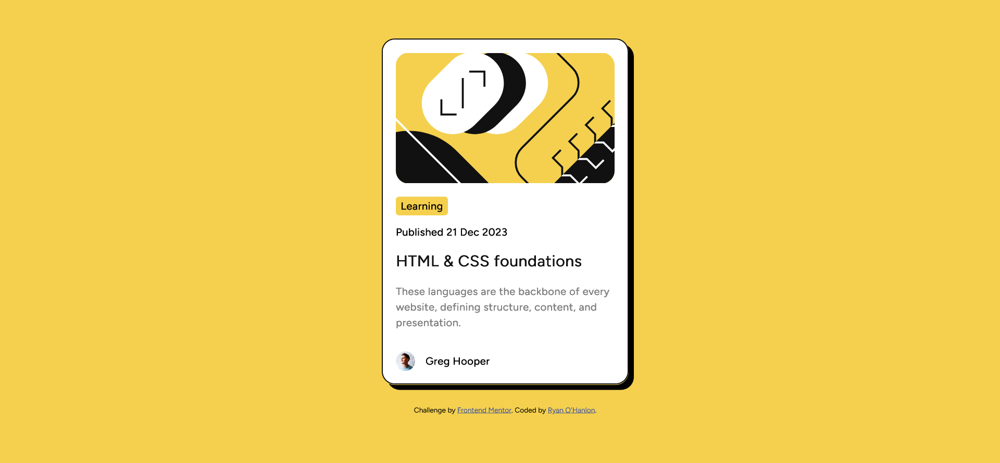

# Frontend Mentor - Blog preview card solution

This is a solution to the [Blog preview card challenge on Frontend Mentor](https://www.frontendmentor.io/challenges/blog-preview-card-ckPaj01IcS). Frontend Mentor challenges help you improve your coding skills by building realistic projects. 

## Table of contents

- [Overview](#overview)
  - [The challenge](#the-challenge)
  - [Screenshot](#screenshot)
  - [Links](#links)
- [My process](#my-process)
  - [Built with](#built-with)
  - [What I learned](#what-i-learned)
  - [Continued development](#continued-development)
  - [Useful resources](#useful-resources)
- [Author](#author)
- [Acknowledgments](#acknowledgments)

**Note: Delete this note and update the table of contents based on what sections you keep.**

## Overview

### The challenge

Users should be able to:

- See hover and focus states for all interactive elements on the page

### Screenshot



### Links

- Solution URL: [https://www.frontendmentor.io/solutions/blog-preview-card-using-html-and-css-RtB39RIfcv](https://www.frontendmentor.io/solutions/blog-preview-card-using-html-and-css-RtB39RIfcv)
- Live Site URL: [https://ryan-ohanlon.github.io/blog-preview-card-main](https://ryan-ohanlon.github.io/blog-preview-card-main)

## My process

### Built with

- Semantic HTML5 markup
- CSS custom properties
- Flexbox

### What I learned

This challenge taught me responsive design using box and using main and div elements to create boxes using padding to create a box to contain text elements. I also learned to implement the :hover action to change the color of text when a mouse is over a text element.

Using my knowledge from the qr-component challenge, I had an easier time ensuring that the project would be in the middle of the webpage using the properties position, top, left, and transform.

UPDATE: Changed body CSS to flex upon recommendation from feedback.

```css
body{
    background-color: hsl(47, 88%, 63%);
    position: absolute;
    top: 50%;
    left: 50%;
    transform: translate(-50%, -50%);
}
```
```css
body{
    background-color: hsl(47, 88%, 63%);
    display: flex;
    flex-direction: column;
    align-items: center;
    justify-content: center;
    min-height: 100vh;
}
```

While I'm proud of knowing how to create a box to contain elements using main and div, my real challenge for this project was using the attributes margin and padding to ensure a responsive design between desktop and mobile. My solution involved assigning each div element their own class and use em values so each element is spaced out appropriately.

```css
div.learning{
    background-color: hsl(47, 88%, 63%);
    border-radius: 5px;
    padding: 5px;
    margin-top: 1em;
    margin-bottom: 1em;
    margin-right: 16em;
    font-weight: 800;
    text-align: center;
}
```
The final thing I learned was using flex for the first time. In order to get the profile picture and the text Greg Hooper to be aligned vertically required using flex. There is a lot more I need to learn about the display attribute with grid and flex. Same with the position attribute to ensure that all elements are aligned and placed on a webpage. I also used margin-left to create spacing between the profile image and Greg Hooper's name.

```css
.name{
    font-weight: 800;
    font-size: 16px;
    display: flex;
    align-items: center;
}
span{
    margin-left: 1em;
}
```

### Continued development

I'd like to learn more about how to use the attributes position and display. Positioning and aligning elements on a webpage using CSS is a lot more critical than I imagined when it comes to building a website that has responsive design.

I'd also like to figure out if there is a better solution to use margin and padding to create boxes for text elements as you see with the text "Learning" to ensure the size will be responsive. As well as understand how em works when using margin and padding attributes.

### Useful resources

- [FrontEnd Mentor QR Component Project](https://ryan-ohanlon.github.io/qr-code-component-main/) - This helped me as I was able to use this project as a foundation. It helped me how to place the project in the middle of the webpage and how to use elements as containers to create elements like the yellow box containing the text "Learning".

## Author

- Website - [Ryan O'Hanlon](https://ryan-ohanlon.github.io/)
- Frontend Mentor - [@Ryan-OHanlon](https://www.frontendmentor.io/profile/ryan-ohanlon)
- Twitter - [@RyanROHanlon](https://www.twitter.com/ryanrohanlon)

## Acknowledgments

I'd like to thank IZY_BOY for providing feedback on the QR Code component project. His feedback helped me provide a starting point to research how to use position: absolute and flex.
